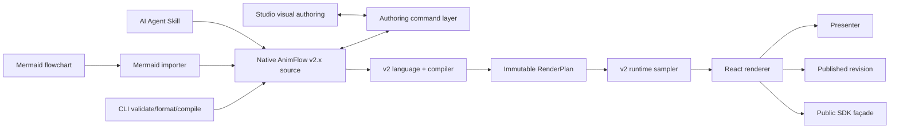

# Design: AnimFlow Authoring Platform after DSL v2

Generated by /office-hours on 2026-08-23
Branch: `main`
Repo: `viviviviviid/animflow-dsl`
Status: APPROVED
Mode: Builder
Approved: 2026-08-23
Implementation baseline: `0f42c1477b594b3e042af16190d85dbde091aa5a`

## 1. 결정 요약

AnimFlow의 다음 제품은 Mermaid 편집기의 복제품이 아니라 **기술 강의를 위한 실행 가능한 다이어그램 저작 도구**다.

사용자는 Mermaid를 가져오거나 AI가 만든 native AnimFlow v2 소스를 열고, 캔버스의 노드·엣지를 클릭해 장면별 연출을 붙인다. 결과는 같은 소스를 사용하는 Studio, Presenter, 공개 URL, React SDK에서 동일하게 재생된다.

확정한 방향은 다음과 같다.

1. native AnimFlow v2 소스가 정본이다.
2. Mermaid는 가져오기·마이그레이션 입력이며 내부 정본이 아니다.
3. v1 제품의 핵심은 구조 편집이 아니라 장면과 연출 편집이다.
4. 첫 지원 범위는 flowchart다.
5. 첫 출력은 브라우저 라이브 프레젠테이션과 공유 URL이다.
6. 개발 순서는 `CLI → Agent Skill → Studio → Presenter → Publish → Public SDK`다.
7. 완료된 DSL v2 구현을 contract handoff로 인수한 다음, 저작에 필요한 최소 언어 확장은 별도 ADR과 호환성 테스트를 통해 v2.1로 추가한다.

## 2. 문제 정의

Mermaid는 AI가 생성하기 쉽고 문서 도구에 널리 들어갔지만, 강의자가 개념을 순서대로 설명하려면 별도 슬라이드 도구에서 요소를 다시 만들거나 영상 편집으로 타이밍을 맞춰야 한다. 반대로 PowerPoint식 편집기는 클릭 기반 연출에는 강하지만 다이어그램의 의미 구조와 코드 기반 재사용성이 약하다.

AnimFlow가 해결할 좁고 명확한 문제는 다음과 같다.

> 구조화된 기술 다이어그램에 의미 기반 연출 순서를 붙여, 코드와 시각 편집을 오가며 라이브로 가르치게 한다.

### 2.1 시장 경계

- Mermaid Chart는 이미 text/visual 양방향 구조 편집과 presentation을 제공한다. AnimFlow가 범용 Mermaid editor로 경쟁할 이유가 없다.
  <https://mermaid.ai/docs/build-and-edit/use-the-visual-editor>
  <https://mermaid.ai/docs/share-and-present/build-a-presentation>
- Mermaid-to-Excalidraw는 Mermaid를 편집 가능한 캔버스 형태로 변환하는 공개 playground/package 영역을 차지한다.
  <https://github.com/excalidraw/mermaid-to-excalidraw>
- tldraw는 shape/camera animation primitive와 slideshow interaction의 참고 구현이다.
  <https://tldraw.dev/sdk-features/animation>

따라서 AnimFlow의 차별점은 diagram conversion이나 자유 캔버스가 아니라 **stable semantic target에 강의 장면·타이밍·narration을 결합하고, AI와 사람이 같은 소스로 편집하는 choreography compiler**다.

## 3. 목표 사용자와 핵심 작업

### 3.1 첫 사용자

- 본인처럼 개발·AI·시스템 설계 강의를 만드는 기술 강사
- Mermaid를 생성하는 AI Agent
- 코드로 콘텐츠를 관리하면서 최종 연출은 눈으로 조정하려는 개발자

### 3.2 핵심 작업

1. Mermaid flowchart를 붙여 넣거나 `.animflow`를 연다.
2. Mermaid 입력이면 native v2 소스로 한 번 변환한다.
3. 캔버스에서 노드 또는 엣지를 선택한다.
4. 현재 장면에 `reveal`, `focus`, `trace`, `hide`, `camera`, `narration` 같은 typed action을 추가한다.
5. 장면 카드를 재정렬하고 즉시 재생·역재생·탐색한다.
6. 전체 화면 Presenter로 강의하거나 불변 revision의 공유 URL을 발행한다.
7. 같은 문서를 React SDK로 강의 사이트에 삽입한다.

## 4. 제품 경계

### 포함

- native v2 소스 열기, 검증, 포맷, 저장
- Mermaid flowchart 가져오기와 변환 결과 확인
- 노드·엣지 선택과 scene/action 편집
- 장면 추가, 복제, 삭제, 이름 변경, 재정렬
- 액션 속성 편집과 타깃 무결성 검사
- 재생, 일시정지, 장면 이동, 임의 시점 탐색
- 로컬 자동 저장과 복구
- Presenter와 읽기 전용 공유 URL
- CLI, Agent Skill, React SDK façade

### 첫 버전에서 제외

- 캔버스에서 노드·엣지 생성, 삭제, 재연결
- Mermaid 전체 문법 지원
- 자유 형식 CSS, HTML, JavaScript, GSAP 코드
- 동시 협업과 댓글
- PPT, MP4, GIF 내보내기
- Studio 안의 AI 채팅
- 청중 동기화, 퀴즈, 분석, Replay 제품
- 모바일 저작
- 플러그인 생태계

구조 편집을 제외하는 이유는 범위 축소만이 아니다. 첫 제품의 정체성을 “또 하나의 다이어그램 편집기”가 아니라 **의미 기반 choreography layer**로 보존하기 위해서다.

## 5. 검증한 현재 상태와 선행 조건

현재 저장소에는 v1 React 패키지와 Next.js 데모가 있고, v2 구현은 다음 패키지로 완료되어 기본 `/` 데모로 cutover됐다. `/legacy`는 명시적 v1 경로로 남아 있다.

- `packages/model`
- `packages/language`
- `packages/compiler`
- `packages/runtime`
- `packages/react-v2`
- `packages/migrate`

v2 계획은 Langium 기반 정적 검증, 불변 `RenderPlan`, 순수 시간 샘플링, 명시적 stable ID, 결정적 geometry를 바인딩 결정으로 둔다. 이는 Studio와 SDK가 공유해야 할 기반이다.

v2 계획에 기록된 cutover 결과는 v2 관련 43개와 유지된 v1 5개를 합친 48개 test 통과, `/`와 `/legacy`의 Next.js production build 성공이다. 승인 시점의 baseline commit `0f42c14`에서 다음 gate를 Turbo cache 없이 다시 확인했다.

- `pnpm exec turbo run test --force`: 14/14 tasks 성공, 48 tests 통과
- `pnpm exec turbo run build --force`: 8/8 tasks 성공, `/`와 `/legacy` static production build 성공
- `pnpm exec turbo run lint --force`: 15/15 tasks 성공

`lint test build`를 한 Turbo 호출로 병렬 실행하면 `next build`가 `.next/types`를 갱신하는 동안 `web:lint`가 파일을 읽어 `TS6053`이 발생할 수 있다. CI와 handoff 검증은 세 command를 순차 실행하며, 별도 후속 작업에서 pipeline dependency를 직렬화한다.

후속 개발 착수 조건은 다음과 같다.

1. v2 구현의 clean install, build, lint, test 결과가 기록돼 있다.
2. language/compiler/runtime/react-v2의 공개 export와 진단 형식이 정리돼 있다.
3. 동일 소스와 timestamp가 동일 `FrameState`를 만든다는 contract test가 통과한다.
4. 패키지 이름과 import path가 확정돼 있다.
5. v1 migration 결과와 알려진 손실이 문서화돼 있다.

조건을 만족하기 전에는 Studio가 v2 내부 AST나 임시 타입에 결합하면 안 된다.

## 6. 선택한 정보 구조

### 기본: Canvas-first Creator

- 상단: 문서, Import Mermaid, undo/redo, Present, Publish
- 왼쪽: source/import 패널. 기본은 접을 수 있음
- 중앙: 가장 큰 16:9 캔버스와 직접 선택
- 오른쪽: 선택 대상의 속성, action, narration inspector
- 하단: PowerPoint와 유사한 scene card strip

이 레이아웃은 강의 결과물을 크게 보면서 선택과 연출을 같은 화면에서 끝내는 데 최적이다.

### 확장 모드

- **Timeline-first Director:** 여러 action의 겹침과 narration 파형이 필요할 때 여는 고급 모드
- **Source + Preview Split:** AI가 만든 소스와 진단을 검토하거나 대량 수정할 때 쓰는 개발자 모드

세 레이아웃은 별도 제품이 아니라 동일한 문서와 command model을 보는 workspace preset이다.

## 7. 시스템 구조



### 7.1 단일 정본

Studio와 Agent Skill은 같은 `.animflow` 소스를 만든다. Studio 전용 JSON, AI 전용 중간 포맷, 런타임 전용 숨은 의미 모델을 만들지 않는다.

`RenderPlan`은 빌드 산출물이지 저작 정본이 아니다. 사용자가 수정하는 대상은 native v2 소스다.

### 7.2 Authoring command layer

Studio가 소스 문자열을 임의 정규식으로 고치지 않도록, Phase 2의 `@animflow-dsl/authoring` 패키지에 typed command API를 둔다.

예시 command:

```ts
type AuthoringCommand = { baseRevision: number } & (
  | { type: "source.replace"; source: string }
  | { type: "scene.add"; after?: SceneId; scene: SceneDraft }
  | { type: "scene.move"; scene: SceneId; after?: SceneId }
  | { type: "scene.remove"; scene: SceneId }
  | { type: "action.add"; scene: SceneId; action: ActionDraft }
  | { type: "action.update"; scene: SceneId; action: ActionId; patch: ActionPatch }
  | { type: "action.remove"; scene: SceneId; action: ActionId }
  | { type: "narration.set"; scene: SceneId; narration: NarrationDraft }
);
```

각 command는 다음 상태 중 하나를 원자적으로 반환한다.

```ts
type AuthoringResult =
  | { status: "applied-valid"; documentRevision: number; planRevision: number;
      transactionId: TransactionId; source: string; diagnostics: readonly Diagnostic[] }
  | { status: "applied-invalid-draft"; documentRevision: number;
      lastValidPlanRevision?: number; source: string; diagnostics: readonly Diagnostic[];
      transactionId: TransactionId }
  | { status: "rejected"; reason: "revision-conflict" | "invalid-semantic-command";
      currentRevision: number; diagnostics: readonly Diagnostic[] };
```

필수 성질:

- stable ID를 보존한다.
- 무관한 사용자 포맷과 주석을 가능한 한 보존한다.
- 적용 후 항상 같은 language validator를 실행한다.
- semantic visual command가 실패하면 원본을 바꾸지 않는다. `source.replace`만 invalid draft를 명시적으로 저장할 수 있다.
- transaction log로 undo/redo가 가능하다.
- source range가 바뀌어도 semantic selection을 ID로 복구한다.

v2의 현재 stable ID 계약에는 action ID가 없다. 시각 저작에서 action 수정·삭제를 안전하게 지원하기 위해 Phase 0에서 다음 v2.x 확장을 ADR-AUTH-001로 승인하고 구현한다.

```animflow
animflow 2.1

action revealFlow: sequence {
  action revealClient: show client via fade
  action traceRequest: draw request via trace
}
```

- `animflow 2`는 완료된 초기 v2, `animflow 2.1`은 action identity를 포함한 authoring source version이다. 표기는 숫자처럼 보이지만 AST와 public API에서는 `AnimFlowSourceVersion = "2" | "2.1"` 문자열 discriminant로 다룬다. `RenderPlan.version`은 별도 artifact contract이므로 이 변경으로 자동 상승시키지 않는다.
- `ActionId`는 다른 semantic ID와 마찬가지로 문서 전체에서 유일하다.
- scene-scoped `say`를 제외한 모든 `SceneStatement`는 `action <id>:` 접두사를 갖는다. 실행 leaf뿐 아니라 `sequence`와 `stagger`, 그 안의 중첩 statement도 각각 ID를 갖는다.
- language/model/compiler/diagnostics/formatter/migrate를 함께 변경한다.
- `animflow migrate file --from 2 --to 2.1`은 scene별 pre-order로 `<sceneId>_actionNNN` 형식의 deterministic ID를 생성한다. 기존 graph/story/scene/element/overlay ID와 충돌하면 번호를 증가시켜 문서 전체 uniqueness를 보장하며, CST offset 내림차순 insertion edit로 주석과 선언 순서를 보존한다.
- `animflow 2`는 최소 한 minor release 동안 compatibility compiler에서 변경 없이 compile된다. Studio로 편집하려면 2.1 migration을 먼저 수행한다.
- 기존 v2 fixture 원본은 compatibility suite에서 계속 compile되고, 2.1로 migration한 fixture는 action provenance를 제외해 기존과 deep-equal한 `FrameState`를 만든다.
- compiler는 `RenderPlan.authoring.actions`에 action ID, scene ID, parent action ID, kind, source range를 action당 한 번 보존한다. 각 animation track에는 optional `actionId`만 연결해 source range 중복과 structured-clone 비용을 피한다. v2 plan은 authoring metadata가 없거나 빈 배열이며 기존 runtime은 이 additive field를 무시할 수 있다.
- 중복·누락 ID fixture, round-trip, migration determinism, 기존 v2 fixture compatibility가 모두 통과해야 한다.

source range나 배열 index를 영구 identity로 사용하지 않는다.

V1 source는 현재 grammar와 동일하게 문서당 정확히 하나의 story만 허용한다. `StoryId` 자체는 source와 `RenderPlan` 식별자로 유지하지만 Authoring command, Studio, Presenter, Publish, SDK에 story selector를 추가하지 않는다. multi-story는 실제 강의 use case가 확인된 뒤 별도 ADR로 다룬다.

코드 편집도 별도 경로가 아니다. editor의 변경은 debounced `source.replace` transaction으로 들어간다.

- 모든 command의 `baseRevision`이 현재 revision과 다르면 적용하지 않고 `revision-conflict`를 반환한다. debounced raw edit가 대기 중이면 visual command 전에 먼저 flush한다.
- 유효한 변경은 visual command와 같은 undo/redo history에 들어간다.
- 유효하지 않은 변경도 draft와 diagnostics로 저장하지만 last-valid plan은 별도 revision에 묶는다.
- invalid source를 보는 동안 stale preview는 읽기 전용이다. canvas selection으로 action을 추가할 수 없다.
- 다시 유효해지면 stable ID로 selection을 복구하고 새 plan revision을 활성화한다.
- invalid draft의 undo는 직전 document revision을 복구하고, redo는 동일 invalid draft와 diagnostics를 복구한다.

revision은 되돌리지 않는 단조 증가 정수다. `undo({ baseRevision })`와 `redo({ baseRevision })`는 session API이며 저장된 command를 직접 재사용하지 않는다. session이 현재 head에 맞춰 내부 inverse를 적용하고 새 revision과 transaction ID를 만든다. 따라서 오래된 UI event나 저장된 inverse가 최신 source를 덮어쓸 수 없다.

## 8. AI 전용 Agent Skill

Agent Skill은 “DSL 문법을 설명하는 긴 프롬프트”가 아니다. Agent가 유효한 결과를 반복 생성하도록 만드는 작은 개발 도구 체인이다.

### 8.1 구성

```text
skills/animflow-authoring/
  SKILL.md
  references/
    language-reference.md
    lecture-patterns.md
    diagnostics.md
  examples/
    request-lifecycle.animflow
    architecture-walkthrough.animflow
    algorithm-stepthrough.animflow
  scripts/
    validate-example.sh
  evals/
    prompts.jsonl
    expected.json
```

실제 배치 경로는 배포 방식이 결정된 후 확정하지만, Skill 자체는 저장소에서 버전 관리한다.

### 8.2 Agent 작업 루프

1. 사용자 의도에서 강의 목표, 대상 수준, 핵심 단계, 예상 시간을 추출한다.
2. 최소 graph와 stable ID를 먼저 만든다.
3. 전체 graph가 한 번에 보이지 않도록 scene별 teaching beat를 설계한다.
4. typed action과 narration을 추가한다.
5. `animflow validate --json`을 실행한다.
6. 진단 code와 source range를 사용해 수정한다.
7. `animflow compile --json`으로 summary와 duration을 확인한다.
8. 성공한 `.animflow`와 간단한 강의 개요를 반환한다.

### 8.3 CLI 계약

```text
animflow validate lesson.animflow --json
animflow format lesson.animflow --check
animflow compile lesson.animflow --out lesson.render-plan.json
animflow migrate legacy.animflow --to 2.1 --out lesson.animflow
animflow import-mermaid graph.mmd --out lesson.animflow
animflow version --json
animflow capabilities --json
```

필수 규칙:

- 사람용 출력은 읽기 쉽게, `--json`은 최상위 `schemaVersion`, `command`, `ok`, `data`, `diagnostics` envelope를 사용한다.
- 진단은 v2 계약의 `code`, `severity`, `message`, `range`, `fixes[]`를 그대로 사용한다.
- exit code는 `0=성공`, `1=validation/compile 실패`, `2=잘못된 CLI 사용`, `3=I/O 실패`, `4=호환되지 않는 버전`, `5=resource limit`으로 고정한다.
- stdin은 파일 대신 `-`로만 받고, stdout에는 결과, stderr에는 로그만 쓴다. JSON mode의 stdout에는 JSON 외 텍스트를 쓰지 않는다.
- 파일 출력은 같은 디렉터리의 임시 파일에 쓴 뒤 atomic rename하며, 기존 파일은 `--force` 없이는 덮어쓰지 않는다.
- 같은 입력은 byte-stable format과 의미적으로 동일한 compile 결과를 만든다.
- 문서 크기, compile 시간, scene/action 수의 안전 한도를 둔다.

`data` payload도 command별로 고정한다.

| command | `data` |
|---|---|
| `validate` | `{ valid, sourceVersion }` |
| `format` | `{ changed, formattedSource?, outputPath? }` |
| `compile` | `{ summary: { storyIds, sceneCount, actionCount, durationMs }, artifactPath?, artifactHash? }` |
| `migrate` / `import-mermaid` | `{ sourceVersion, generatedSource?, outputPath?, generatedIds, unsupportedFeatures }` |
| `version` | `{ cliVersion, languageVersion, compilerVersion }` |
| `capabilities` | `{ sourceVersions, diagramKinds, actions, limits }` |

flag 조합은 다음으로 닫는다.

- `--json`은 report 형식만 바꾸며 `--out`과 함께 쓸 수 있다. Skill의 `compile --json`은 artifact를 stdout에 싣지 않고 summary를 반환한다.
- `compile --out`은 artifact를 파일에 쓰고 경로와 SHA-256을 report한다.
- `format --check`, `--write`, `--out`은 서로 배타적이다. `--check`는 파일을 쓰지 않으며 변경 필요 시 exit `1`; `--write`는 positional file만 in-place 변경하고 stdin `-`와 함께 쓰면 exit `2`; `--out`은 file/stdin 모두 지원한다.
- `--force`는 이미 존재하는 `--out`에만 의미가 있고, 그 외 조합은 exit `2`다.
- `-` stdin과 `--out`은 함께 사용할 수 있다. stdin과 positional file을 동시에 주면 exit `2`다.
- `migrate`와 `import-mermaid`는 `--out`이 없으면 human mode에서 generated source를 stdout에, JSON mode에서 `data.generatedSource`에 반환한다.
- 실패 envelope는 `ok: false`, `data: null`, 한 개 이상의 diagnostic을 가진다. 성공 envelope는 `ok: true`이며 warning만 포함할 수 있다.
- 지원 범위 밖 요청은 diagnostic `AFCLI004_CAPABILITY_MISMATCH`와 exit `4`를 반환한다.

Phase 0 formatter는 Langium CST 기반 deterministic syntax formatter다. 공백·줄바꿈·들여쓰기만 정규화하고 주석과 선언 순서는 보존하며 `format(format(source)) === format(source)`를 보장한다. 의미가 같은 모든 문서를 같은 byte로 재출력하는 semantic canonical printer는 만들지 않는다. Phase 2의 preservation-aware patch printer는 command가 건드린 AST 영역만 정규화하고 나머지 token/comment trivia를 보존하는 별도 API다.

### 8.4 Skill 품질 기준

- 최소 10개 강의 프롬프트 fixture에서 유효한 native v2 소스를 생성한다.
- 존재하지 않는 target, 중복 ID, 잘못된 action 속성을 스스로 수정한다.
- 지원하지 않는 Mermaid 기능을 조용히 근사하지 않고 명시적으로 보고한다.
- 너무 많은 동시 연출, 읽을 수 없는 narration 속도 같은 교육적 품질 경고를 포함한다.
- Skill 버전과 DSL/compiler 버전의 호환 범위를 선언한다.
- 각 fixture는 필수 concept/target, scene 수 범위, duration 범위, narration 존재 여부, 허용 action을 machine-readable assertion으로 가진다.
- 고정 model/version/temperature에서 fixture별 3회 실행해 compile 성공률 100%, semantic assertion 통과율 90% 이상을 요구한다.
- 지원하지 않는 요청은 부분 결과를 성공으로 내지 않고 capability mismatch를 반환한다.
- Phase 1에서 Codex와 Claude Code 설치 경로, CLI 탐색 규칙, OS 지원 범위, 호환 실패 메시지를 함께 검증한다.

## 9. Studio 상호작용 계약

### 9.1 선택

- 클릭: node/edge 하나 선택
- Shift+클릭: 여러 target 선택. 첫 버전에서는 같은 action을 일괄 추가하는 용도만 허용
- 캔버스 선택은 stable ID로 inspector와 source range를 연결
- 구조를 바꾸는 resize handle, reconnect handle, delete key는 제공하지 않음

### 9.2 장면과 action

- `Add scene`은 이전 장면의 최종 상태를 새 장면의 시작 상태로 보여준다.
- 선택한 element와 action type에 맞지 않는 조합은 UI에서 비활성화하고 이유를 표시한다.
- 기본 action은 `Reveal`, `Focus`, `Trace`, `Hide`, `Camera`, `Narration`으로 제한한다.
- scene card는 이름, thumbnail, duration, error/warning badge를 보여준다.
- 드래그 재정렬은 command transaction 한 번으로 기록한다.

UI 이름과 native v2 source의 규범적 매핑은 다음과 같다.

| Studio | native v2 |
|---|---|
| Reveal | `show` |
| Focus | `highlight` |
| Trace | `draw` |
| Hide | `hide` |
| Camera | `camera` |
| Narration | scene-scoped `say` |

### 9.3 재생

- 편집 preview와 Presenter는 같은 runtime sampler를 쓴다.
- 순차 재생 후 특정 timestamp의 frame과 직접 seek한 frame이 같아야 한다.
- 이전 장면 이동과 backward seek가 side effect replay에 의존하지 않아야 한다.
- `prefers-reduced-motion`에서는 의미 상태는 유지하되 전환 시간을 줄이거나 제거한다.

### 9.4 오류 처리

- 오류가 있는 마지막 유효 compile 결과는 source revision과 plan revision을 함께 표시하는 `STALE PREVIEW` 워터마크로만 보여준다.
- stale preview는 seek만 가능하고 selection 기반 action 편집은 막는다.
- Publish와 SDK export는 오류가 하나라도 있으면 차단한다.
- 진단 클릭 시 source range와 관련 element를 동시에 강조한다.
- importer가 지원하지 않는 Mermaid 구문은 위치와 대체 방법을 보여주며 누락을 숨기지 않는다.

## 10. Presenter와 Publish

### Presenter

- 단일 story 전체 화면, 다음/이전 장면, 재생/일시정지, 장면 점프
- 강사용 speaker notes와 청중용 canvas를 분리할 수 있는 기반만 둠
- URL query나 remote message로 arbitrary code를 실행하지 않음
- 키보드와 pointer 모두로 조작 가능

### Publish

- 게시할 때 문서의 단일 story source를 compile하고 immutable revision을 만든다.
- 공유 URL은 revision을 가리켜 이후 편집으로 강의가 바뀌지 않는다.
- 초기는 계정 없는 local-first 저작 + 명시적 publish로 시작할 수 있다.
- published revision에는 deterministic-formatted source, compiled artifact, story ID, source schema/compiler/runtime version, SHA-256 integrity hash를 함께 저장한다.
- viewer는 revision에 기록된 artifact schema와 호환되는 versioned runtime을 선택한다. 호환 runtime을 제공할 수 없는 revision은 조용히 재compile하지 않고 명시적으로 중단한다.
- anonymous publish 전에는 enumeration-resistant ID, 문서·IP별 quota, 기본 30일 보존, 삭제 token, 신고·차단·takedown 절차와 privacy notice를 확정한다.
- 비공개 초안, 인증, 조직 협업은 첫 버전 밖이다.

## 11. Public SDK façade

외부 사용자는 내부 `language/compiler/runtime/react-v2` 패키지 조합을 직접 맞추지 않는다. 하나의 버전된 façade를 제공한다.

예상 사용 형태:

```tsx
import { AnimFlowPlayer } from "@animflow/sdk-react";

<AnimFlowPlayer
  source={lessonSource}
  story="main"
  controls
  onDiagnostic={handleDiagnostic}
/>
```

SDK 원칙:

- 첫 public SDK는 단일-story source만 입력받는다. compiled artifact 입력은 private viewer contract이며 공개 semver API가 아니다.
- React renderer, compiler, runtime의 호환 버전을 façade가 고정한다.
- 내부 AST를 public API로 노출하지 않는다.
- 기본 렌더는 deterministic하고 네트워크 요청이 없다.
- CSP 친화적이며 raw HTML/JS를 실행하지 않는다.
- SSR에서는 안전한 placeholder 또는 명시적 client boundary를 제공한다.
- 최소 예제 앱을 별도 clean install CI에서 검증한다.

## 12. 안전성과 신뢰성

공개 사이트는 신뢰할 수 없는 입력을 받는 compiler 서비스다.

- 브라우저 compile worker에서 parse/compile하고 main thread를 차단하지 않는다. protocol은 `ready`, `compile`, `result`와 monotonic job ID를 가진 typed discriminated union으로 제한한다. `ready`에는 worker protocol version, 지원 source version, compiler version, RenderPlan version을 포함한다. 대기 중 요청은 latest-wins로 병합하고 stale result는 버린다.
- structured clone은 `Object.freeze()` 상태를 보존하지 않는다. model package의 공용 `freezeRenderPlan`을 compiler와 worker client가 함께 사용하고, main thread는 수신 plan을 다시 freeze한 뒤 runtime에 전달한다. worker 결과를 받은 React component가 mutable plan을 직접 보관하지 않는다.
- source bytes, element 수, scene 수, action 수, compile 시간에 한도를 둔다.
- 실행 중 JavaScript compile은 worker message로 선점할 수 있다고 가정하지 않는다. hard timeout, active-job 취소, 메모리 예산 초과는 worker를 terminate/recreate해 보장한다. 서버 compile 격리와 동시 작업 상한은 Publish 단계에서 구현한다.
- raw HTML, script, `foreignObject`, event attribute, remote asset URL, `javascript:`/`data:` URL, CSS injection을 금지한다. 모든 label, diagnostic, source, SVG attribute, share metadata는 context별 escaping을 적용한다.
- 공유 페이지는 strict CSP를 사용한다.
- import/compile 실패가 서버 process를 종료하지 않도록 격리한다.
- 공개 publish API에는 rate limit과 abuse logging을 둔다.
- diagnostic과 analytics에 전체 비공개 source를 기본 수집하지 않는다.
- canonical artifact와 integrity hash, 호환 runtime을 보존해 과거 revision 재생을 재현한다.
- autosave는 IndexedDB의 revisioned document store를 사용한다. source와 metadata를 한 transaction으로 기록하며 quota 실패를 노출한다.
- multi-tab은 BroadcastChannel로 writer lease를 표시하고 충돌 시 자동 병합하지 않는다. 사용자는 다른 사본으로 저장할 수 있다.
- local draft의 export/delete와 schema migration, invalid draft recovery를 테스트한다.

첫 public release의 hard cap은 source 256KiB, 100 nodes, 150 edges, 30 scenes, 600 actions, action nesting depth 32, compile wall time 2초다. Publish 단계의 server compile은 process당 동시 2개와 대기열 50개, anonymous publish는 IP당 분당 10회·하루 100문서·revision 2MiB로 시작한다. 초과는 부분 결과 없이 resource-limit diagnostic을 반환한다. 실측 변경은 보안 한도를 낮추지 않는 ADR로만 허용한다.

초기 성능 예산:

- 예제 기준 100 nodes / 150 edges / 30 scenes를 지원
- 저장소에 고정한 Chromium 버전과 CI runner profile에서 30회 warm run 기준 compile p95 200ms 목표
- 같은 환경의 300회 scrub sample 기준 frame 갱신 p95 50ms 목표
- 60초 autosave debounce가 아니라 변경 후 짧은 idle checkpoint와 crash recovery 사용

예산 수치는 구현 초기에 benchmark fixture로 검증하고 현실에 맞게 ADR로 조정한다.

## 13. 테스트 전략

### Contract

- v2 parser/compiler/runtime contract test를 선행 gate로 유지
- 같은 source와 timestamp의 `FrameState` deep equality
- serialize/deserialize와 compiler version fixture
- browser worker bundle, structured clone, cancellation, stale-result suppression, worker restart contract
- published artifact hash와 versioned runtime 재생 fixture
- source version matrix: v2 anonymous statement 허용, v2.1의 모든 non-`say` statement ID 필수, version/syntax mismatch 진단
- nested `sequence`/`stagger`의 action ID uniqueness, parent provenance, leaf track provenance
- v2→v2.1 migration의 pre-order ID, 기존 ID collision 회피, 주석 보존, 반복 실행 determinism
- formatter idempotence와 format 전후 compile 의미 보존. 의미 비교는 source hash와 authoring metadata를 제외하고 scene 경계·track 시작/중간/끝 timestamp의 `FrameState`를 deep-equal한다.

### Authoring

- command별 적용/실패/inverse/undo/redo 단위 테스트
- scene reorder와 target 삭제 충돌 테스트
- 주석·포맷 보존 golden test
- command sequence property test: 성공한 모든 중간 source가 validator를 통과

### CLI와 Skill

- exit code, stdout/stderr, JSON schema snapshot
- 10개 Agent prompt의 compile 및 semantic assertion eval을 고정 model 설정에서 fixture별 3회 실행
- 의도적으로 망가진 소스를 진단 기반으로 복구하는 eval
- Skill/compiler 버전 불일치 테스트

### Studio

- React integration: selection ↔ inspector ↔ source range
- Playwright: import → select → action → reorder → present → reload → publish
- keyboard, screen reader label, reduced-motion 검사
- scene thumbnail과 주요 frame visual regression

### 공개 입력

- parser/importer fuzz test
- 매우 깊은 graph, 긴 label, 많은 parallel edge, zero-duration action
- compile timeout과 worker recovery
- CPU/memory/concurrent-job limit과 worker/server recovery
- label, diagnostic, source, SVG attribute, metadata별 XSS/CSP fixture와 URL scheme 제한
- anonymous publish quota, atomic write, hash 검증, deletion token, retention cleanup

통합 테스트는 mock보다 실제 package 조합을 우선한다.

Phase 0에서 새로 추가하거나 분기 조건을 바꾼 module은 statements, branches, functions, lines 100% coverage를 요구한다. 기존 package 전체의 과거 미커버 코드를 Phase 0 gate에 소급 포함하지는 않지만, 변경한 기존 branch의 양쪽 경로는 반드시 fixture로 고정한다. grammar generated file은 직접 수정하지 않고 `langium:generate` 결과가 clean한지 CI에서 확인한다.

## 14. 단계별 실행 계획

### Phase 0 — 완료된 v2 인수와 저작 계약 확장

- v2 계획에 기록된 48 tests와 production build 결과를 현재 worktree의 clean install, build, lint, test로 재검증한다.
- 공개 export, diagnostics, versioning, sample contract를 문서화한다.
- ADR-AUTH-001에서 단일-story V1, 문자열 source version, 전 statement ActionId, additive RenderPlan authoring metadata를 고정한다.
- deterministic syntax formatter와 browser compile worker protocol에 대한 ADR을 승인한다. Monaco LSP는 Studio 단계, server worker와 published artifact compatibility는 Publish 단계로 미룬다.
- ADR-AUTH-001의 grammar/model/compiler/diagnostics/formatter/migrate 변경과 compatibility fixture를 구현한다.
- worker 초기 JS는 gzip 1.5MB 이하, pinned CI의 20회 cold run p95 ready 500ms 이하, 30회 warm compile p95 200ms 이하로 한다.
- 100-node/150-edge/30-scene/600-action 기준 `RenderPlan` structured clone + main-thread freeze 100회 p95 50ms 이하, stale job 반영 0건, active job terminate 후 다음 valid compile 성공을 요구한다.
- resource limit은 worker 시작 전 source byte 수를, parse 직후 node/edge/scene/action/nesting 수를 검사한다. 2초 timeout fixture 이후 worker 재생성과 정상 compile을 검증한다.
- browser memory는 전체 process RSS 한 번이 아니라 pinned Chromium CDP의 worker heap을 warmup 뒤 반복 측정해 plateau 여부와 128MiB hard cap을 함께 본다. benchmark는 runner, OS, Node, Chromium, fixture hash를 결과에 기록한다.

구현은 다음 세 gate로 나눈다.

1. **0A Language contract:** `ActionId`, 문자열 source version, v2/v2.1 grammar와 validator, RenderPlan authoring metadata, compiler provenance와 model invariant. `@animflow-dsl/model`, `language`, `compiler`의 root export만 사용한다.
2. **0B Source tools:** Langium formatter service와 v2→v2.1 CST insertion migration. diagnostics code는 중앙 registry에 추가하고 generated AST/grammar/Monarch는 generator로만 갱신한다.
3. **0C Browser isolation:** private `@animflow-dsl/browser-worker` package에 versioned typed protocol과 client lifecycle을 둔다. `apps/web`은 이 package만 호출하고 compiler를 main thread에서 직접 import하지 않는다. client는 structured-clone 결과를 공용 `freezeRenderPlan`으로 재수화한다.

각 gate는 별도 diff로 검증 가능해야 하며 `pnpm test`, `pnpm build`, `pnpm lint`를 서로 다른 Turbo invocation으로 순차 실행한다. 한 Turbo invocation에서 `build`와 web `lint`를 병렬 실행하면 `.next/types` 생성물이 경쟁할 수 있으므로 root `verify` script와 CI도 이 순서를 고정한다. 성능 benchmark는 일반 unit-test job과 분리된 pinned Playwright workflow에서 raw sample JSON과 p50/p95/max를 artifact로 남기고, absolute budget 또는 직전 승인 baseline 대비 20%를 넘으면 실패시킨다.

완료 기준: 위 ADR 구현·compatibility suite·수치형 browser spike가 모두 통과하고, 후속 패키지가 v2 내부 파일을 deep import하지 않으며 compiler output에서 모든 v2.1 action을 stable ID로 식별할 수 있다. 실제 source patch command는 Phase 2 Authoring package의 완료 기준이다.

### Phase 1 — CLI와 Agent Skill

- `validate`, `format`, `compile`, `migrate`, `import-mermaid`, `version`, `capabilities`의 안정 CLI를 만든다.
- Mermaid flowchart importer의 지원 matrix와 실패 정책을 정의한다.
- Agent Skill, examples, eval fixtures를 만든다.
- JSON diagnostic contract를 CI에 고정한다.
- Skill 설치·CLI discovery·version mismatch 흐름을 Codex와 Claude Code에서 검증한다.

완료 기준: 고정 model 설정의 30회 실행에서 compile 성공률 100%, semantic assertion 통과율 90% 이상이며 CLI contract test가 모두 통과한다.

### Phase 2 — Authoring command layer

- typed command, source patch, selection mapping, transaction, undo/redo를 만든다.
- preservation-aware patch printer의 token/comment 보존 범위를 golden test로 고정한다.

완료 기준: 모든 지원 action을 문자열 조작 없이 생성·수정·삭제하고, command별 valid/rejected/invalid-draft test, exact undo/redo round-trip, selection ID 복구, 100-sequence property test, 30개 formatting golden fixture가 통과한다.

### Phase 3 — Studio MVP

- Canvas-first Creator를 구현한다.
- source/import, canvas selection, inspector, scene strip, autosave를 연결한다.
- Timeline-first와 Source Split workspace preset은 Studio MVP 이후로 미룬다.

완료 기준: pinned Playwright Chromium/Firefox/WebKit에서 Mermaid import → select → action → reorder → preview → reload/recovery가 성공한다. raw/visual race와 하나의 undo history, stale-preview edit 차단, invalid-draft recovery, IndexedDB quota 실패, multi-tab writer 충돌 test가 모두 통과한다.

### Phase 4 — Presenter와 Publish

- full-screen Presenter, keyboard controls, immutable revision share를 만든다.
- untrusted input limits, CSP, rate limit을 적용한다.

완료 기준: 발행된 revision이 이후 편집과 무관하게 같은 frame을 재생하고, CSP/XSS·resource limit·worker/server recovery·quota·atomic publish·hash·deletion/retention 테스트가 모두 통과한다.

### Phase 5 — Public SDK façade

- 내부 패키지를 감싼 React SDK와 API 문서를 만든다.
- clean consumer app CI와 semver 정책을 추가한다.

완료 기준: `pnpm pack` tarball을 빈 React fixture에 설치한 뒤 typecheck, production build, test를 실행한다. source/story 입력, diagnostic callback, SSR placeholder, invalid source, version mismatch assertion이 모두 통과한다.

## 15. 성공 기준

1. 본인이 실제 10분 분량 기술 강의 하나를 Studio로 제작하고 라이브로 끝까지 진행한다.
2. Mermaid 경험이 있는 3명의 첫 시도 중앙값으로 flowchart import 후 첫 animation 추가까지 3분 이내다.
3. AI Skill은 고정된 10개 프롬프트를 fixture별 3회 실행해 compiler 통과율 100%, semantic assertion 통과율 90% 이상이다.
4. forward seek, backward seek, restart 결과가 contract fixture에서 동일하다.
5. 저장·새로고침·복구 후 stable target과 scene 순서가 보존된다.
6. 오류가 있는 문서는 Publish할 수 없고, 사용자가 원인을 source와 canvas에서 찾을 수 있다.
7. 공개 SDK 예제가 clean install CI에서 재현된다.
8. 공개 공유 URL에서 raw HTML/JS 실행과 remote asset injection이 불가능하다.

## 16. 배포 전략

- Studio와 공개 viewer: Vercel의 기존 Next.js 앱으로 배포하되 authoring logic은 패키지로 분리
- 익명 Publish 저장소: Supabase Postgres의 RLS 차단 테이블, service-role-only RPC, Cron retention으로 운영하고 브라우저의 직접 DB 접근을 금지
- 서버 compile: Vercel Node Function의 추적된 `worker_threads` asset에서 실행하며 별도 2초 timeout과 in-instance concurrency/queue cap을 유지
- SDK/CLI: npm package와 GitHub release
- Agent Skill: 저장소 버전과 DSL/compiler compatibility를 명시해 설치 가능하게 배포
- 문서: public playground의 예제와 같은 source를 SDK 문서·Skill eval에서 재사용
- 초기 유입: “Mermaid를 animated lecture로 변환”하는 공개 landing/import flow

## 17. 남은 결정

Phase 0 package 경계는 `@animflow-dsl/model`, `language`, `compiler`, `migrate`의 root export와 private `@animflow-dsl/browser-worker`로 확정한다. 후속 package는 `@animflow-dsl/cli`, `authoring`, `sdk`를 사용하고 SDK만 최종 public façade가 된다.

아래 결정은 Phase 0을 막지 않으며 각 소비 단계에서 확정한다.

- 기본 30일 보존 기간을 실제 사용량 검증 후 늘릴지 여부
- Mermaid importer를 `migrate`에 둘지 별도 package로 둘지
- 공개 artifact 입력 API는 첫 SDK 이후 실제 수요와 compatibility 비용을 보고 결정

## 18. 버린 접근

### A. 현재 `apps/web`에 Studio 기능을 직접 추가

초기 화면은 빠르지만 source edit, undo/redo, diagnostics가 앱 내부 상태로 굳어 CLI·Skill·SDK와 갈라진다.

### B. Mermaid를 정본으로 유지하고 animation 메타데이터만 별도 저장

원본 재가져오기와 Mermaid formatter 변화가 stable ID와 target 연결을 깨뜨린다. strict v2 언어와도 이중 정본 문제가 생긴다.

### C. tldraw 같은 범용 캔버스 엔진으로 renderer 교체

선택·카메라 상호작용 참고에는 유용하지만, 지금 교체하면 결정적 v2 renderer와 병행 구현이 된다. 첫 제품에는 채택하지 않는다.

### D. Agent Skill보다 Studio를 먼저 구현

보이는 진척은 빠르지만 CLI와 structured diagnostics가 없는 상태에서 Studio가 임시 parser API에 결합한다. AI-first 제품이라는 차별점도 늦어진다.

## 19. Cross-model 관점

독립 검토는 AnimFlow를 단순 animated diagram이 아니라 **Presenter / Audience / Replay로 확장 가능한 executable lecture**로 정의했다. 이 관점은 장기 방향으로 유지한다.

동시에 첫 버전에서 구조 편집까지 포함하자는 반론이 있었다. 결정은 구조 편집을 제외하는 것이다. Mermaid Chart와 범용 캔버스가 이미 강한 영역에 들어가기보다 choreography 완성도를 먼저 검증한다.

독립 검토에서 채택한 핵심은 다음 두 가지다.

- Studio와 Agent Skill은 같은 source와 compiler diagnostics를 사용한다.
- tldraw는 상호작용 참고 대상이지 현 renderer의 즉시 대체재가 아니다.

## 20. The Assignment

완료된 v2에 새 기능을 만들기 전에 **v2 contract handoff**를 한 번 수행한다.

산출물은 한 페이지면 충분하다.

- 실제 package 목록과 public exports
- build/lint/test 결과
- source → diagnostics/RenderPlan → FrameState 최소 예제
- 안정된 계약과 임시 계약의 구분
- Phase 1 CLI/Skill이 의존해도 되는 API

이 인수 문서가 통과한 뒤 Phase 1을 시작한다.

## 21. What I noticed about how you think

- “강의를 만들 때 쓰고 싶다”는 개인의 반복 작업에서 출발해 제품 범위를 잡았다. 첫 dogfood 시나리오가 명확하다.
- “AI가 쓸 가능성이 크다”는 판단으로 UI만이 아니라 언어, CLI, Skill의 배포 단위를 함께 본다.
- 완성도와 버그 방지를 우선하면서도 v1에서 구조 편집을 빼는 선택을 했다. 기반에는 엄격하고 제품 범위에는 절제하는 방향이다.
- 다른 AI가 구현 중인 계획을 먼저 검토하고 후속 작업 경계를 나눴다. 병렬 개발에서 계약 충돌을 피하는 판단이다.


## 22. Phase 0 Eng Review 산출물

### NOT in scope

- **Multi-story:** 현재 단일-story grammar와 강의 V1 요구를 유지한다. 실제 분기 강의 use case가 확인된 뒤 별도 ADR로 다룬다.
- **Monaco LSP:** Phase 0은 compile 격리만 해결한다. completion, hover, definition은 Studio 단계에서 붙인다.
- **Server compile과 publish artifact:** 격리, quota, retention, versioned replay는 Publish 단계의 실제 server boundary에서 구현한다.
- **Authoring patch command:** Phase 0은 stable identity와 provenance까지만 만든다. CST patch, undo/redo session은 Phase 2다.
- **Semantic canonical printer:** 주석과 선언 순서를 파괴할 수 있어 제외한다. deterministic syntax formatter만 제공한다.
- **구조 편집과 범용 canvas 교체:** choreography-first 제품 범위 밖이며 기존 v2 renderer를 유지한다.
- **npm public publish:** Phase 0의 browser-worker package는 private이다. CLI/Skill은 Phase 1, public SDK 배포는 Phase 6에서 검증한다.

### What already exists

| Sub-problem | Existing implementation | Phase 0 reuse |
|---|---|---|
| Parse, link, validate | `@animflow-dsl/language`의 singleton Langium service와 memory document release | 같은 service를 v2/v2.1과 formatter에서 사용 |
| Deterministic compile | `@animflow-dsl/compiler`의 source → immutable `RenderPlan` | ActionId provenance만 additive 확장 |
| Source coordinates | `@animflow-dsl/model`의 `SourcePosition`, `SourceRange`, typed diagnostics | action index와 migration edit에 재사용 |
| Playback and rendering | pure runtime sampler와 React v2 renderer | worker가 만든 plan을 그대로 재생 |
| Editor feedback | Monaco Monarch token과 diagnostic marker | LSP를 재구축하지 않고 worker diagnostics 연결 |
| Migration | `@animflow-dsl/migrate`의 deterministic legacy → v2 source generation | 별도 v2→v2.1 CST insertion API 추가 |
| Regression base | 48 v2 tests, production build, lint가 현재 commit에서 순차 통과 | compatibility gate로 유지 |

### Phase 0 data flow와 worker state

```text
.animflow source
      |
      v
[main-thread byte cap]
      |
      v  compile(jobId, source)
[versioned worker client] ---- ready(protocol/source/compiler/plan versions)
      |
      v
[browser worker]
  parse -> validate -> semantic caps -> compile -> freeze
      |
      v  result(jobId, diagnostics, plan?)
[stale job filter]
      |
      v
[clone + freezeRenderPlan] -> runtime sampler -> React renderer

Worker lifecycle:
BOOTING -> IDLE -> COMPILING -> IDLE
                    |   |
          newer job|   |timeout / active cancel / crash
                    v   v
              KEEP_LATEST   TERMINATE -> BOOTING
```

Inline ASCII diagram comments는 `@animflow-dsl/browser-worker`의 client lifecycle과 protocol reducer에만 둔다. model의 discriminated unions와 compiler의 단방향 lowering은 타입과 함수 경계로 충분하며 중복 설명을 넣지 않는다.

### Failure modes

| Codepath | Production failure | Test | Handling and user signal |
|---|---|---|---|
| Source version dispatch | v2 header에 v2.1 action syntax가 섞임 | version/syntax matrix | version-mismatch diagnostic, source range 표시 |
| Action validation | 중첩 action ID가 누락되거나 다른 element ID와 충돌 | nested/global uniqueness fixtures | compile 거부, duplicate/missing ID diagnostic |
| v2→v2.1 migration | 생성 ID가 기존 declaration과 충돌하거나 주석 위치가 바뀜 | collision/comment golden + repeat determinism | 원본 미변경, diagnostic과 generated source를 분리 반환 |
| Formatter | 두 번째 format에서 byte가 다시 바뀌거나 의미가 변함 | idempotence + sampled FrameState equivalence | invalid output을 반환하지 않고 원본과 diagnostic 유지 |
| Worker handshake | UI와 worker bundle version이 다름 | mismatch fixture | compile 차단 후 reload/update 안내 |
| Latest-wins scheduling | 느린 이전 job 결과가 최신 preview를 덮음 | out-of-order result integration test | monotonic job filter가 stale result 폐기 |
| Active compile | CPU-bound compile이 cancel message를 처리하지 못함 | timeout/terminate/recovery Playwright test | worker terminate/recreate, last-valid preview와 명시적 상태 표시 |
| Structured clone | plan의 runtime freeze가 사라져 소비자가 mutation | clone+freeze invariant test | client가 `freezeRenderPlan` 후에만 plan 공개 |
| Resource limits | 깊은 action nesting이나 최대 입력이 stack/heap을 소진 | boundary/fuzz fixtures | byte cap 선검사, semantic cap diagnostic, worker recovery |
| CI verification | Next build와 web lint가 `.next/types`를 동시에 변경 | root verify smoke test | test → build → lint를 별도 Turbo invocation으로 실행 |

위 실패 모드는 모두 test와 error handling, 사용자에게 보이는 diagnostic 또는 상태를 갖는다. silent critical gap은 0개다.

### Worktree parallelization

| Step | Modules touched | Depends on |
|---|---|---|
| 0A Language contract | `packages/model`, `packages/language`, `packages/compiler` | — |
| 0B Source tools | `packages/language`, `packages/migrate` | 0A |
| 0C Browser isolation | `packages/browser-worker`, `apps/web` | 0A |
| 0D Benchmark and CI | root CI/config, browser benchmark | 0B, 0C |

Lane A: 0A를 먼저 완료한다.

Lane B: 0B source tools.

Lane C: 0C browser isolation.

0A 병합 후 Lane B와 Lane C를 별도 worktree에서 병렬 실행하고, 둘을 병합한 뒤 0D를 실행한다. B와 C는 primary module이 겹치지 않지만 둘 다 workspace metadata를 바꿀 수 있으므로 `pnpm-lock.yaml`과 `pnpm-workspace.yaml`은 0D 통합 시 한 번 재생성한다.

### Implementation Tasks

Synthesized from this review's findings. Each task derives from a specific finding above. Run with Claude Code or Codex; checkbox as you ship.

- [x] **T1 (P1, human: ~6h / CC: ~45min)** — Language contract — 문자열 source version과 모든 non-`say` statement의 ActionId를 구현한다.
  - Surfaced by: Architecture — NUMBER version과 anonymous nested scheduling node는 장기 호환성과 stable editing을 깨뜨린다.
  - Files: `packages/model`, `packages/language`
  - Verify: language version matrix, nested ID, global collision test와 `langium:generate` clean diff

- [x] **T2 (P1, human: ~5h / CC: ~40min)** — Compiler/model — normalized action provenance와 clone-safe `freezeRenderPlan`을 구현한다.
  - Surfaced by: Architecture/Performance — source range 반복과 structured clone의 freeze 손실
  - Files: `packages/model`, `packages/compiler`, `packages/runtime`
  - Verify: model invariant, leaf/parent provenance, v2 compatibility, clone+freeze tests

- [x] **T3 (P1, human: ~4h / CC: ~30min)** — Formatter — Langium CST 기반 deterministic syntax formatter를 구현한다.
  - Surfaced by: Code Quality — AST canonical printer는 comment trivia를 잃는다.
  - Files: `packages/language`
  - Verify: formatter idempotence, comment/order golden, sampled FrameState equivalence

- [x] **T4 (P1, human: ~5h / CC: ~40min)** — Migration — collision-free v2→v2.1 insertion migration을 구현한다.
  - Surfaced by: Architecture — 기존 `<sceneId>.actionNNN` 제안은 현재 ID grammar에서 불법이다.
  - Files: `packages/migrate`, `packages/language`
  - Verify: pre-order IDs, global collision, nested action, comment preservation, repeat determinism

- [x] **T5 (P1, human: ~8h / CC: ~60min)** — Browser worker — versioned latest-wins worker client와 terminate/recovery lifecycle을 구현한다.
  - Surfaced by: Architecture — 현재 `V2Player`가 main thread에서 compile하며 message cancellation은 active CPU work를 선점하지 못한다.
  - Files: `packages/browser-worker`, `apps/web`
  - Verify: handshake mismatch, stale result, timeout, crash, next-valid recovery Playwright tests

- [x] **T6 (P2, human: ~5h / CC: ~35min)** — Verification — resource caps, coverage gate, serial root verify, reproducible performance workflow를 만든다.
  - Surfaced by: Tests/Performance — 기존 test/build/lint는 통과하지만 worker/resource/performance 계약은 아직 fixture와 pinned runner가 없다.
  - Files: root CI/config, changed package tests, browser benchmark
  - Verify: new/changed code 100% coverage, sequential verify, bundle/compile/clone+freeze/memory budgets and raw artifacts
  - Shipped: Chromium 151 고정 workflow, 100/150/30/600 상한 fixture, CDP worker heap plateau, raw JSON artifact, worker 전체 module 100% coverage gate

- [x] **T7 (P1)** — CLI와 Mermaid importer — 안정된 JSON envelope, exit code, atomic output, resource cap과 strict flowchart subset을 구현한다.
  - Files: `packages/cli`, `packages/migrate`
  - Verify: 실제 Node bin, JSON schema, format/compile/migrate/import contract, package tarball

- [ ] **T8 (P1)** — Agent Skill 평가 — repository Skill과 10 prompt semantic eval을 고정 model로 3회씩 실행한다.
  - Files: `skills/animflow-authoring`
  - Shipped: Skill/reference/examples, fixture-mode 30/30 compile 및 semantic assertion, 외부 고정-model runner contract
  - Remaining gate: `ANIMFLOW_EVAL_COMMAND`와 고정 model/version/temperature를 지정한 실제 30회 생성 평가

- [x] **T9 (P1)** — Authoring command layer — typed source patch, revision, transaction, undo/redo와 selection 복구를 구현한다.
  - Shipped: `@animflow-dsl/authoring`의 CST-local scene/action/narration 명령, v2.1 gate, monotonic document/plan revision, atomic rejection, invalid source draft와 last-valid plan, exact snapshot undo/redo, ID selection remap
  - Verify: 8개 action kind compile round-trip, command valid/rejected/invalid-draft, 30 formatting/comment golden, 동일 100-command sequence의 매 단계 compile 및 최종 source/hash determinism

- [x] **T10 (P1)** — Studio MVP — Canvas-first Creator, persistence/recovery, inspector와 scene strip을 통합한다.
  - Shipped: browser authoring worker, canvas/source selection, action inspector, cue rail reorder, narration, undo/redo, invalid-draft stale preview, atomic IndexedDB revisions, multi-tab writer lease, local-only lazy Monaco worker
  - Verify: production build, root test/build/lint 순차 gate, Chromium/Firefox/WebKit 24개 E2E (Mermaid → select → action → reorder → preview, reload recovery, invalid repair, quota, writer conflict, offline editor, responsive overflow)

- [x] **T11 (P1)** — Presenter와 Publish — full-screen 재생과 immutable revision 공유 계약을 구현한다.
  - Shipped: local/public Presenter, keyboard/pointer scene transport, separated speaker notes, create-only 30-day revision store, one-time deletion token, canonical SHA-256, version-gated replay, strict public CSP, persistent cross-process quotas, isolated server compile worker and public privacy/report surfaces
  - Verify: publish package unit/integration tests and Chromium/Firefox/WebKit E2E for local Presenter, immutable public playback, label/title XSS escaping, CSP, invalid/oversized input, deletion and post-delete replay stop

- [x] **T12 (P1)** — Public SDK — React façade, SSR/diagnostic/version contract와 clean consumer 설치 검증을 구현한다.
  - Shipped: `@animflow/sdk-react` 0.1.0 façade with bundled compatible compiler worker/runtime/renderer, single-story assertion, controlled transport, SSR placeholder, diagnostic/ready callbacks, self-hosted worker override, API and semver documentation
  - Verify: package tests for invalid source, story and protocol mismatch; tarball install into a non-workspace React fixture; typecheck, esbuild production bundle, SSR test and real Chromium worker/render smoke test with no internal runtime dependency

- [x] **T13 (P1)** — Dogfood acceptance — 실제 10분 강의와 cross-browser·보안·복구 인수 기준을 완료한다.
  - Shipped: 10-scene/41-action/600,000ms AI agent runtime lecture fixture and dated acceptance record; Studio readiness/file-import race fixed from dogfood
  - Verify: CLI compile, deterministic forward/back/restart contract, 36 Chromium/Firefox/WebKit product E2E, accelerated 600,000ms playback in all engines, 600-second real-time Chromium replay, 320 deterministic parser/importer hostile mutations
  - External launch evidence, not claimed by engineering: three-person first-use study and credentialed fixed-model Skill evaluation

- [x] **T14 (P1)** — Vercel + Supabase live deployment — Studio와 immutable Publish를 Seoul region production에 배포하고 실제 공개 경로를 검증한다.
  - Shipped: `SupabasePublishStore`, RLS/immutable/least-privilege/quota/cleanup migrations, active daily Cron, Vercel client-IP hashing, dependency-aware monorepo build, Seoul Functions, server worker output tracing and public URL
  - Verify: 13 publish tests, temporary-PostgreSQL migration contract, live Supabase privilege inspection, three concurrent publish/delete canaries, focused publish E2E 9/9, final Chromium/Firefox/WebKit product E2E 36/36, traced 780,674-byte server worker asset
  - Live: <https://animflow-studio.vercel.app> with GitHub `main` automatic production delivery


### Completion Summary

- Step 0: Scope Challenge — full roadmap에서 Phase 0으로 scope reduced per recommendation
- Architecture Review: 8 issues found, 8 folded
- Code Quality Review: 4 issues found, 4 folded
- Test Review: diagram produced, 6 gaps identified and covered in the plan
- Performance Review: 4 issues found, 4 folded
- NOT in scope: written
- What already exists: written
- TODOS.md updates: 0 items; deferred work already has an owning roadmap phase
- Failure modes: 0 critical gaps after review
- Outside voice: skipped because this review is already running under Codex; free in-host challenge found no tension
- Parallelization: 3 implementation lanes, 2 parallel after 0A and 2 sequential gates
- Lake Score: 22/22 recommendations chose the complete option within Phase 0

Retrospective: current HEAD `0f42c14` is the first deterministic v2 implementation commit. 이 검토는 그 commit의 language/compiler/runtime 경계를 교체하지 않고 additive authoring metadata와 worker isolation만 추가하도록 제한했다. 이전 review-driven revert나 같은 영역의 반복 실패 commit은 발견되지 않았다.


## GSTACK REVIEW REPORT

| Review | Trigger | Why | Runs | Status | Findings |
|--------|---------|-----|------|--------|----------|
| CEO Review | `/plan-ceo-review` | Scope & strategy | 0 | — | — |
| Codex Review | `/codex review` | Independent 2nd opinion | 0 | — | — |
| Eng Review | `/plan-eng-review` | Architecture & tests (required) | 1 | CLEAR (PLAN) | 22 issues, 0 critical gaps; all folded |
| Design Review | `/plan-design-review` | UI/UX gaps | 0 | — | Studio phase 전 실행 |
| DX Review | `/plan-devex-review` | Developer experience gaps | 0 | — | CLI/Skill phase 전 실행 |

**VERDICT:** ENG CLEARED — Phase 0 is ready to implement. Studio UI 전에는 Design Review, CLI/Agent Skill 전에는 DX Review를 실행한다.

NO UNRESOLVED DECISIONS
